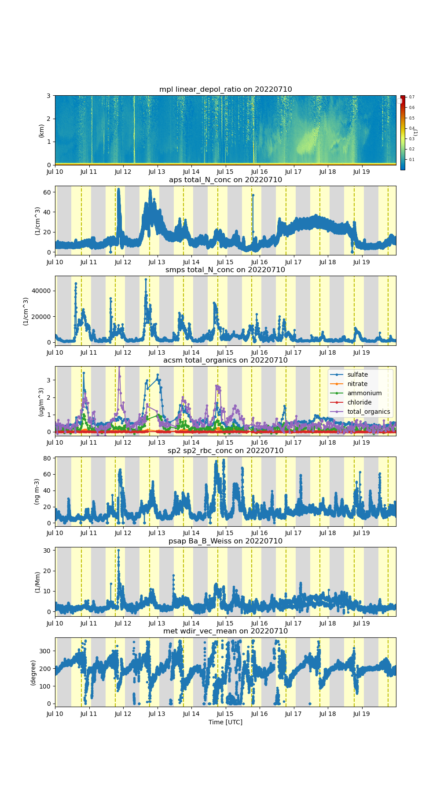

# Background
These tutorials cover ARM's JupyterHub resources, basic python, and the [Atmospheric data Community Toolkit (ACT)](https://github.com/ARM-DOE/ACT). These tutorials are meant to be generic enough to be able to be utilized for many different events as an introduction to ACT. 

The ACT tutorials were focused around exploring aerosol and lidar data from a dust event during TRacking Aerosol Convection interations ExpeRiment (TRACER) that occurred from July 16-19, 2022.

# Tutorials
### JupyterHub and Jupyter Notebooks
[1-jupter_intro.ipynb](https://github.com/ARM-Development/ARM-Notebooks/blob/main/Tutorials/ACT-Python-Tutorial/1-jupyter_intro.ipynb) is a notebook to get started with ARM's JupyterHub resources and navigate what JupyterHub notebooks are and some useful shortcuts.

### Python Tutorials
[2-Python-Basics.ipynb](https://github.com/ARM-Development/ARM-Notebooks/blob/main/Tutorials/ACT-Python-Tutorial/2-Python-Basics.ipynb) is a what it seems, a notebook to go over beginner Python skills.  For those wanting to explore some more complex libraries in Python, checkout the other notebooks
- [2a-scientific_libraries_numpy.ipynb](https://github.com/ARM-Development/ARM-Notebooks/blob/main/Tutorials/ACT-Python-Tutorial/2a-scientific_libraries_numpy.ipynb)
- [2b-scientific_libraries_pandas.ipynb](https://github.com/ARM-Development/ARM-Notebooks/blob/main/Tutorials/ACT-Python-Tutorial/2b-scientific_libraries_pandas.ipynb)
- [2c-scientific_libraries_xarray.ipynb](https://github.com/ARM-Development/ARM-Notebooks/blob/main/Tutorials/ACT-Python-Tutorial/2c-scientific_libraries_xarray.ipynb)

### Atmospheric data Community Toolkit (ACT) Tutorials
- [3-ACT-Basics-2023.ipynb](https://github.com/ARM-Development/ARM-Notebooks/blob/main/Tutorials/ACT-Python-Tutorial/3-ACT-Basics.ipynb) is a base tutorial using data from the TRACER Particle Soot Absorption Photometer (PSAP) to explore some of the base functionality of ACT including visualizations and working with quality control information.

- [3a-ACT-TRACER-Dust.ipynb](https://github.com/ARM-Development/ARM-Notebooks/blob/main/Tutorials/ACT-Python-Tutorial/3a-ACT-TRACER-Dust.ipynb) is a notebook to bring a variety of datasets together for visualization and performing some of the more complex operations in ACT to produce a figure like the below.

Figure 1. From the top, micropulse lidar linear depolarization ratio, aerodynamic particle sizer concentration, scanning mobility particle sizer concentration, aerosol chemical speciation monitor chemical compositions, single particle soot photometer black carbon concentration, PSAP aerosol absorption coefficient in the blue channel, and the surface meteorology station wind direction.

### Additional Tutorials
There are two additional tutorials for an [Introduction to GitHub and git](https://github.com/ARM-Development/ARM-Notebooks/blob/main/Tutorials/ACT-Python-Tutorial/optional_github_intro.md) and how to perform [Branching and Pull Requests](https://github.com/ARM-Development/ARM-Notebooks/blob/main/Tutorials/ACT-Python-Tutorial/optional_github_branching.md) which are all very important when contributing work back into these open-source packages.
