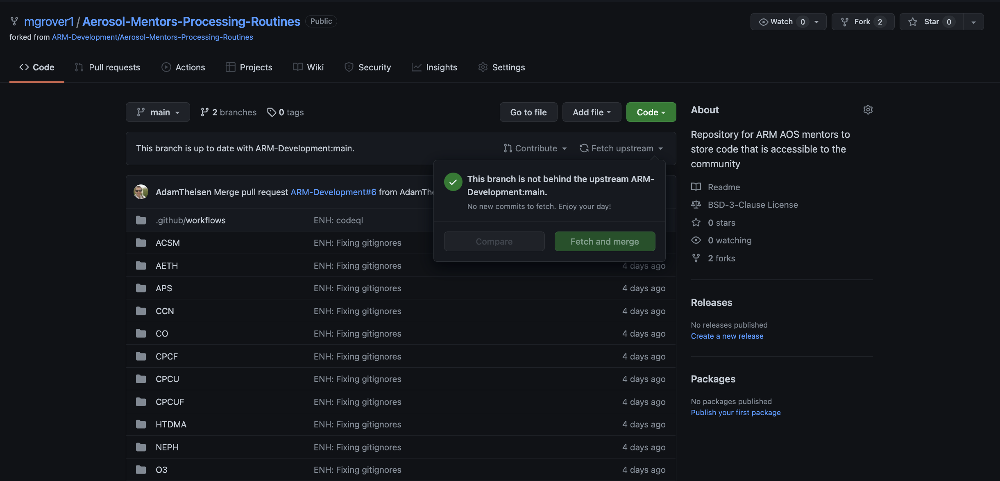
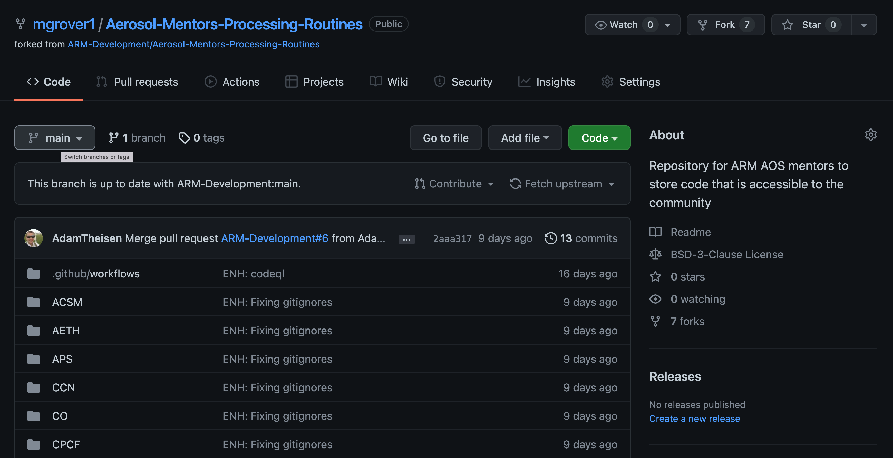
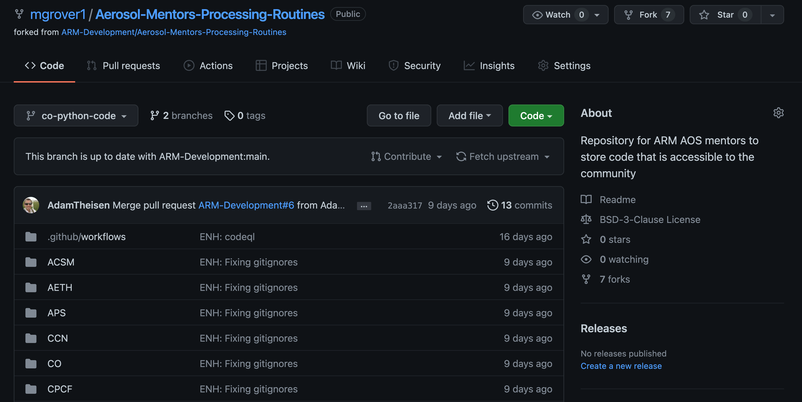
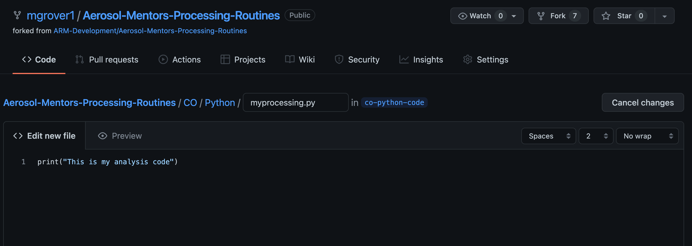
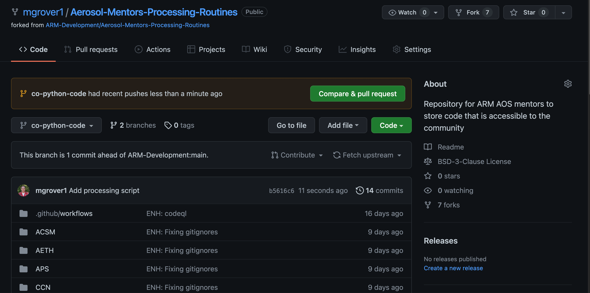

# Branching and Pull Requests on the Github Website

## Overview:

1. Creating a Branch Using the Github Web Interface
1. Making Changes to Our Branch
1. Submitting a Pull Request Using the Github Web Interface

## Prerequisites

| Concepts                                      | Importance | Notes                 |
| --------------------------------------------- | ---------- | --------------------- |
| [Intro to Github](introduction)               | Necessary  | Need an account       |
| [Cloning and Forking a Repo](forking_cloning) | Necessary  | Need forked repo      |
| [Branches and PRs](branching_pull_request)    | Helpful    | Terminology helpful   |

- **Time to learn**: 15 minutes

---

## Creating a Branch Using the Github Web Interface

### Make sure your `main` branch is up to date

A good rule of thumb is to make sure that you **never** add a feature/change on your `main` branch. Another rule to keep in mind is that you **always** want to keep your fork of the repository up to date with the ***upstream*** repository (in this case, this is [Aerosol Mentors Processing Routines](https://github.com/ARM-Development/Aerosol-Mentors-Processing-Routines)).

For example, if you had a different project (for example `CO`) you wanted to make changes to, you would not want to include those changes from `CCN` as well!

Fortunately, Github makes this easy! From **_your fork of the repository_**, you will see a "Fetch upstream" dropdown!

It is important to do this **early and often** and be sure that when you make changes, you follow the process of:

### Creating your Branch

Now that our main branch is in-sync, the first step to contributing is to create a **branch** of your repository!

On the left side of the screen, you will see a box that says "`main`", indicating you are on the `main` branch. You will need to click on `main`, as shown below:

Once you click on `main`, a new window will pop up with the title "Switch branches/tags"

At this point, go ahead and type in the name of your new branch! In this example, we are adding new Python code related to CO processing, so we title our new branch `co-python-code`!

You will also see a button toward the bottom of the window "**Create branch: co-python-code** from main" 

If we click on "**Create branch: co-python-code** from main", we create that new branch!

You'll notice that instead of `main` in the top left-hand corner of the screen, we see our new branch name `co-python-code`

We have successfully created a new branch! 🎉

## Making Changes to Our Branch

Now that we have a new branch, we can make changes! 

### Move into the `CO/Python` directory

Let's migrate into into the CO directory, which can be accessed by clicking through the web interface.

First, we click on the `CO` folder.

You'll see there are now three folders/directories in here! We are interested in adding Python code, so we select Python by clicking on it.

The only file currently in `CO/Python` is a `.gitignore` file... we would like to change that!

### Adding a new Python file

We would like to add a `.py` file to this directory, which can do by selecting add file.

You could also add files from your computer using the "Upload files" option.

We will add a file using the "Create new file" option, which results in the following text editory interface.

We need to add the name of the file, which in this case is `myprocessing.py`

We also add some Python code, which is a `print()` statement

Once we have our changes ready, scroll to the bottom screen where you can add a title to your changes, along with any additional information.

In our example, we add a title of "Add processing script"

Now, click the green button that says "Commit new file" which will commit these changes to your branch (`co-python-code`)!

Once we do that, we are ready to submit our Pull Request.

## Submitting a Pull Request Using the Github Web Interface

When you move back to your fork of the repository, which is the page that should show up after clicking that "Commit new file" button in the previous step, you should see the following screen with a yellow box stating "**co-python-code** had recent pushes less than a minute ago" and a green button stating "Compare & pull request"!

If we click on "Compare & pull request", we can prepare to submit our pull request, requesting that **our new features** be merged with the **upstream ARM-Development** copy of the repository (making these changes useful to the wider community)!

We can add a title to this pull request, as shown below:

Once we are ready to submit these changes, we click on the green button stating "Create Pull Request", which will result in the following:

Our changes have been suggested, and the various code-checkers are running. At this point, the code will be reviewed, you will receive feedback, and once it is approved, it will be merged!

You have now successfully created your first branch, and submitted your first pull request! If you have more questions about the terminology, I encourage you to read through the [Branches and PRs](branching_pull_request) content, in addition to the Github content on [Project Pythia](https://foundations.projectpythia.org/foundations/getting-started-github.html).

---

## Summary
* It is important to keep your fork in-sync with the upstream repository!
* A Pull Request (PR) is a formal mechanism for requesting that changes that you have made to one repository are integrated (merged) into another repository.
* You can create a branch, make changes, then submit a PR with those changes.

### What's Next?
Submitting your code to the [Aerosol-Mentors-Processing-Routines
 Repository](https://github.com/ARM-Development/Aerosol-Mentors-Processing-Routines)!